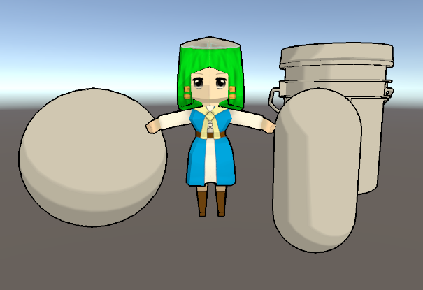

## [WaterWithWave](https://github.com/Tuliyamessenger/UnityShaderPractice/tree/master/WaterWithWave) 
Update 2020.8.7 A simple water effect, can look thought water and see the reflection(limit use). Can custom circle waves on water.

## [FakeWindow](https://github.com/Tuliyamessenger/UnityShaderPractice/tree/master/FackWindow)
Update 2020.8.2 Or say Fake Interior, using a face or cube to display a room to reduce DrawCall.

## [SimpleCartoon](https://github.com/Tuliyamessenger/UnityShaderPractice/tree/master/SimpleCartoon)
Update 2020.7.30 The simple cartoon effect, draw outline and make some cartoonlike shadow.

