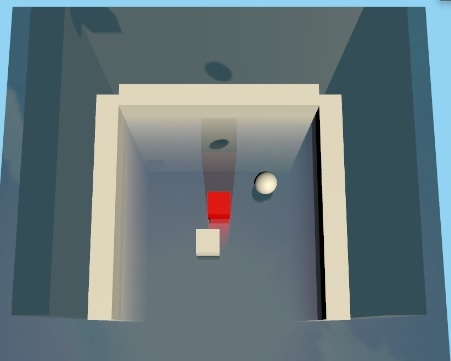

实在不好解决的水面反射问题，因为使用了一个反转的摄像机，所以水底下的东西就会错误的印上来了，想了深度图啥的但是没有比较好的方法去剥离水面下的物体。只能用于没有水下物体的场景了。



摄像机因为各种原因上下左右颠倒，还因为水面的原因获得的图不对。所以干脆就让反射摄像机自己180度翻转，然后再用：
```
GetComponent<Camera>().projectionMatrix *= Matrix4x4.Scale(new Vector3(-1, 1, 1));
```
水平翻转摄像机的画面。不过不知道为何会造成正背面渲染颠倒了，所以再用：
```
void OnPreRender() {
    GL.invertCulling = true;
}
void OnPostRender() {
    GL.invertCulling = false;
}
```
让这个摄像机渲染时翻转剔除，完成后再转回去。

